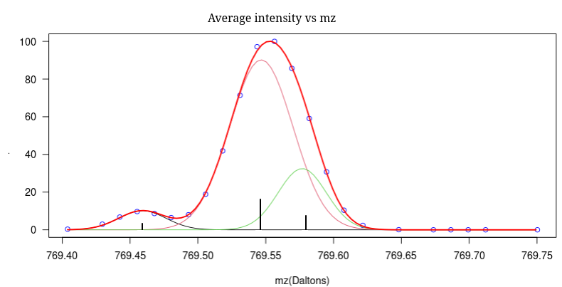

>iCone is an R package oriented to the field of mass spectrometry and focused on image processing (MSI).
Its purpose is to generate a centroid matrix from the information provided by a spectrometer in imzML format.
This is a new peak selection algorithm with a dual purpose: to obtain centroids with high accuracy and to deconvolve overlapping ions.



## Installation

> devtools::install_github("EdelCastillo/iCone")

> Please note that is a development version and no release has been made yet. So, keep looking at this page for future updates and releases.

## Use guide


### **Step 1**.- A list with the necessary parameters is generated.

> For **example**:  
>**params**\ <-list("tolerance"=33, "minPixelsSupport"=5, "SNR"=3,  "SNRmethod"="estnoise_mad");

**Description of the parameters:**

```         
      tolerance:    Desired tolerance for the centroids (ppm)
minPixelSupport:    Minimum percentage of pixels that must provide intensity information for each mass (mz).
                    That is, in the peak matrix, the relative number of pixels with non-zero intensity must be equal to or greater than this.
            SNR:    Signal-to-noise ratio. Discards information based on its proximity to the estimated noise level.
    noiseMethod:    Procedure used for noise estimation:
                      estnoise_diff:  Average of the absolute differences with respect to the mean value.
                      estnoise_sd:    Standard deviation of the absolute differences (Gaussian filter).
                      estnoise_mad:   Median of the absolute deviations (Gaussian filter).
```

### **Step 2**.- The peak selection algorithm is applied and its peak matrix is obtained:

> lst <-**getPeakMatrix**(file_path, params, initMass, finalMass, pxList, nThreads, imzMLChecksum, fixBrokenUUID)

**Description of the parameters:**   
```
      file_path: A list of the absolute paths of the files to be processed is required. 
                 Alternatively, a single filename with the 'txt' extension containing the absolute paths of all files to be processed is acceptable. 
                 In file.txt, lines are considered comments if they begin with the '#' character or the blank character.
                 Only files in 'imzML' format are recognized.
                 The attached binary file, with the 'ibd' extension, must be in the same directory that 'imzML' files.
         params: List of parameters given in Step 1.
       initMass: Initial mass to consider. By default, the minimum value from the entire range of masses is used.
      finalMass: Final   mass to consider. By default, the maximum value from the entire range of masses is used.
         pxList: List of pixels. First pixel=1. By default everyone.
       nThreads: Number of threads for parallel processing (if zero, nThreads=maxCores-1)
  imzMLChecksum: If the binary file checksum must be verified, it can be disabled for convenice with really big files.
  fixBrokenUUID: Set to FALSE by default to automatically fix an uuid mismatch between the ibd and the imzML files (a warning message will be raised).

  return a list: 
    peakMatrix: Matrix of peak (centroids) rows = pixels, columns = intensity of each pixel.
          mass: Vector with the masses associated with each column of peakMatrix.
     tolerance: Vector with the mass tolerance achieved in the peak matrix (ppm).
 pixelsSupport: Vector with the number of pixels in each column with non-zero intensity.
   coordinates: Matrix with pixel coordinates (X/Y).
  pixelsSample: Vector with the number of pixels in each of the samples. In the peakMatrix and coordinates they appear in the same order.
  pixelSize_um: Vector with the size of the pixels (spatial resolution) in micrometers.

```


### **Examples of iCone usage.**
> [iCone_Workshop](https://github.com/EdelCastillo/iCone/blob/main/iConeWorkshop.md "iCone_Workshop")

### **complementary functions.**

> lst <-**getPixelGaussians**(imzML_file_path, params, initMass, finalMass, pixel)

Reports information about a single spectrum.

**Description of the parameters:**   
```
imzML_file_path: Absolute path to the filename with the imzML extension.
                 The attached binary file, with the ibd extension, must be in the same directory.
         params: List of parameters:
                       "tolerance": desired tolerance for the centroids (ppm)
                             "SNR": signal-to-noise ratio
                     "noiseMethod": method for estimating noise (estnoise_diff, estnoise_sd, estnoise_mad).
       initMass: Initial mass to consider.
      finalMass: Final   mass to consider.
          pixel: Reference to the spectrum (the first one is 1)
          
  return a list: 
      gaussians: Matrix with the Gaussian spectra (mass, sigma, intensity).
           mass: Vector with raw masses.
      intensity: Vector with raw intensities.
            SNR: Vector with signal-to-noise ratio for each mass point.
          noise: Noise estimation.
```

> lst <-**getAverageGaussianSpectrum**(imzML_file_path, params, initMass, finalMass, pxList, overSampling, nThreads)

Report the average value of the Gaussian from all data into .imzML file.

**Description of the parameters:**   
```
imzML_file_path: Absolute path to the filename with the imzML extension.
                 The attached binary file, with the ibd extension, must be in the same directory.
         params: List of parameters.
                 "tolerance": desired tolerance for the centroids (ppm)
                       "SNR": signal-to-noise ratio
               "noiseMethod": method for estimating noise (estnoise_diff, estnoise_sd, estnoise_mad).
       initMass: Initial mass to consider.
      finalMass: Final   mass to consider.
         pxList: list of pixels. First pixel=1. By default everyone.
   overSampling: interval between points on the mass axis = tolerance/overSampling.
       nThreads: number of threads
       
  return a list: 
       averageMz: Vector with mass axis. A mass bin is 1/4 of the tolerance parameter
averageIntensity: Vector with intensity axis.
```

> lst <-**getAverageSpectrum**(imzML_file_path, initMass, finalMass, pxList, tolerance, overSampling)

Report the average value of the intensities from all data into .imzML file.
Noise is not taken into account.

**Description of the parameters:**   
```
imzML_file_path: Absolute path to the filename with the imzML extension.
                 The attached binary file, with the ibd extension, must be in the same directory.
       initMass: Initial mass to consider.
      finalMass: Final   mass to consider.
         pxList: list of pixels. First pixel=1. By default everyone.
      tolerance: desired tolerance for the centroids (ppm)
   overSampling: interval between points on the mass axis = tolerance/overSampling.
          
  return a list: 
       averageMz: Vector with mass axis. A mass bin is 1/2 of the tolerance parameter
averageIntensity: Vector with intensity axis.
```

> lst <-**getGaussiansFromSpectrum**(intensity, mass, initMass, finalMass, SNR, noiseMethod)

Report Gaussians over each peak of the given spectrum.

**Description of the parameters:**   
```
   Intensity: vector with value associated with each mass point.
        mass: vector with mass/charge information
     lowMass: lower mass to consider
    highMass: higher mass to consider
         SNR: signal-to-noise ratio
 noiseMethod: method for estimating noise (estnoise_diff, estnoise_sd, estnoise_mad).

return List: gaussians, mass intensity, SNR, noise
       gaussians: matrix with parameters for each Gaussian (mass, sigma, intensity)
            mass: vector with the masses of the raw spectrum
       intensity: intensity associated with each mass of the raw spectrum
             SNR: signal-to-noise ratio associated with each mass of the raw spectrum.
           noise: noise estimation
```
### **other methods**
iCone generates four temporary binary files that can be explored later using the appropriate methods. 
These files are created in the same folder passed as an argument and are overwritten with each execution of the getPeakMatrix() function.

> **getMetaDataFromFile**(file)

Returns generic information about the peak matrix temporary file.


**Description of the parameters:**   
```
  file: file name with peak matrix (tmpPeakMatrix.bin)
  
  Return a list:
   nSamples     -> number of samples analyzed.
   totalPx      -> total number of pixels (cumulative of each sample).
   nIons        -> number of columns in the matrix.
   pixelsSample -> vector with the pixels in each sample.
```

> **getPeakMatrixFromFile**(file)

Return a list whit the peak matrix

**Description of the parameters:**   
```

  file: file name with peak matrix (tmpPeakMatrix.bin)
  return a list:
     peakMatrix: Matrix of peak (centroids) rows = pixels, columns = intensity of each pixel.
           mass: Vector with the masses associated with each column of peakMatrix.
      tolerance: desired tolerance for the centroids (ppm)
  pixelsSupport: Vector with the number of pixels in each column with non-zero intensity. 
```

> **getMassVectorFromFile**(file)

Returns a vector with all the masses in peak matrix 

**Description of the parameters:**   
```
      file: file name with peak matrix (tmpPeakMatrix.bin)
    return: mass vector
 ```
> **getColumFromFile**(file, mass, sample)

Returns a column information of the peak matrix

**Description of the parameters:**   
```
 file     -> file name with peak matrix (tmpPeakMatrix.bin)
 mass     -> reference to the desired initial column of the peak matrix (Da).
 sample   -> just download the pixels from this sample.
             if sample < 0, all sample coordinates are returned
 return a list:
      intensity: vector of intesities 
           mass: mass associated with the column of peakMatrix.
      tolerance: final tolerance at centroid.
  pixelsSupport: number of pixels in column with non-zero intensity. 
```

> **getIntensityFromFile**(file, column)

returns a column whit pixels intensities from the peak matrix

**Description of the parameters:**   
```
      file: file name with peak matrix (tmpPeakMatrix.bin)
    column: matrix column
    return: a vector with intensity of each pixel.
```

> **getCoordinatesFromFile**(file, sample)

Returns a matrix with the coordinates of pixels (X/Y).
If there are multiple samples, they appear sequentially; that is, the matrix has as many rows as the cumulative number of pixels in each sample and two columns.

**Description of the parameters:**   
```
      file: file name with peak matrix (tmpPixelsCoordinates.bin)
    sample: just download the pixels from this sample. If sample < 1 all sample are considered.
```


### **functions for data visualization.**

> **rPlotSpectrum**(values, initMass, finalMass)

View the information returned by the getAverageGaussianSpectrum() and getAverageSpectrum() functions.

**Description of the parameters:**   
```
         values: list returned by the getAverageGaussianSpectrum() and getAverageSpectrum() functions.
       initMass: Initial mass to consider.
      finalMass: Final   mass to consider.
```

> **rPlotGaussianSpectrum**(drawInfo, initMass, finalMass)

View the information returned by the getPixelGaussians() and getGaussiansFromSpectrum() function.

**Description of the parameters:**   
```
       drawInfo: information returned by the getPixelGaussians() function.
       initMass: Initial mass to consider.
      finalMass: Final   mass to consider.
```
> **rPlotGaussianSpectrum2**(drawInfo1, drawInfo2, minMass, maxMass)

Display information from two spectra on the same plot.

**Description of the parameters:**   
```
      drawInfo1: information returned by the getPixelGaussians() function.
      drawInfo2: information returned by the getPixelGaussians() function.
       initMass: Initial mass to consider.
      finalMass: Final   mass to consider.
```
> **rPlotGaussianSpectrum3**(drawInfo1, drawInfo2, drawInfo3, minMass, maxMass)

Display information from tree spectra on the same plot.

**Description of the parameters:**   
```
      drawInfo1: information returned by the getPixelGaussians() function.
      drawInfo2: information returned by the getPixelGaussians() function.
      drawInfo3: information returned by the getPixelGaussians() function.
       initMass: Initial mass to consider.
      finalMass: Final   mass to consider.
```

